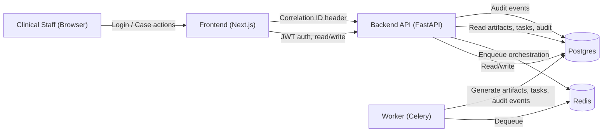

# Architecture

Services: Postgres (5432), Redis (6379), Backend (8000), Worker (Celery), Frontend (3000). Internal network in Docker Compose, ClusterIP in K8s.

## Data Flow Diagram

### Data Notes
- Draft artifacts and tasks are created by the worker and stored in Postgres.
- Approvals and audit events are written by the API.
- Frontend includes correlation IDs in every request for traceability.

## Agent Activation v1 Runtime Topology

1. API receives `/v1/cases/{case_id}/orchestrate` and enqueues a worker task with a correlation ID.
2. Worker executes deterministic agents in order:
   - Data Completeness
   - Draft Generation
   - QA/Policy
3. Artifacts and tasks are persisted with versioning and audit events for every step.
4. State transitions are explicit and stored on the `cases.state` field.

## Scalability and Reliability

- Horizontal scaling via Kubernetes.
- Circuit breakers, retries.
- Disaster recovery: Multi-AZ, backups.
